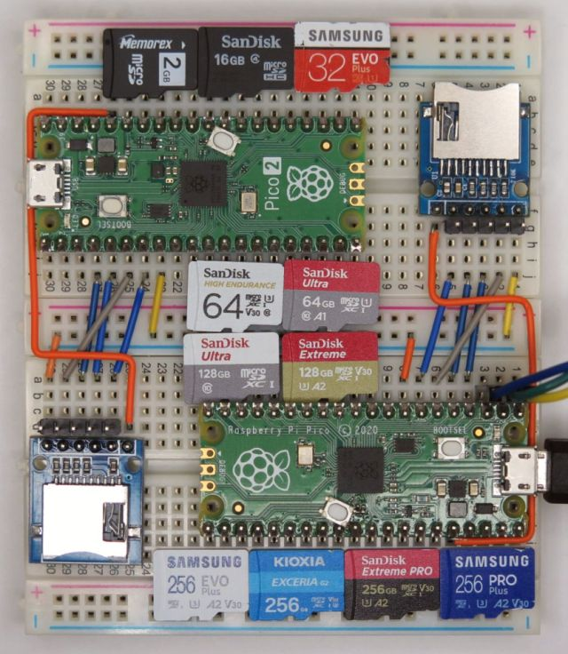
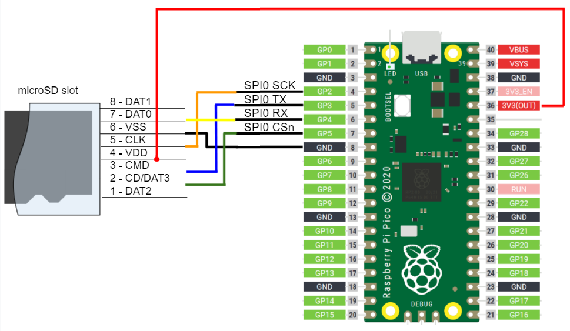
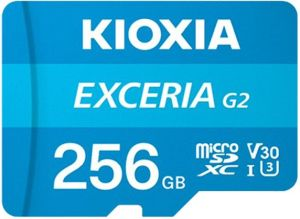
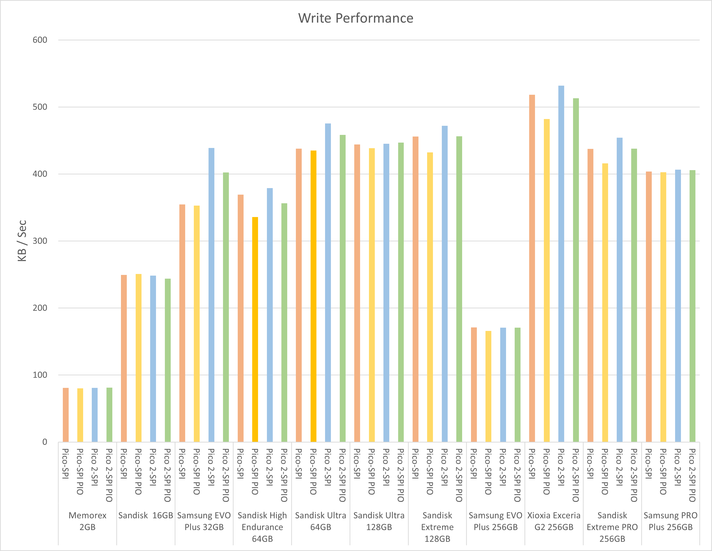
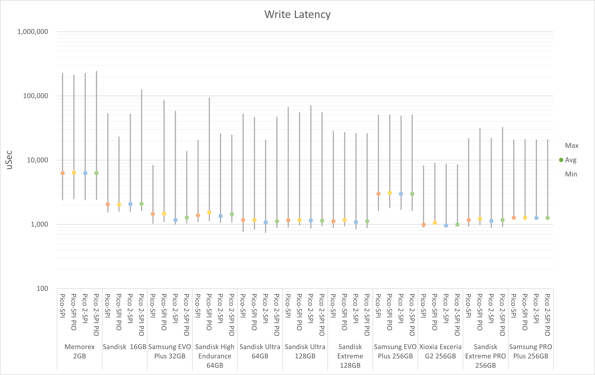
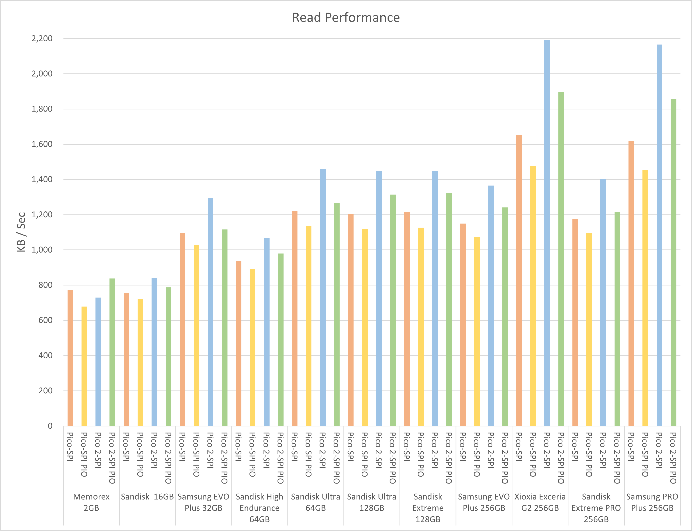
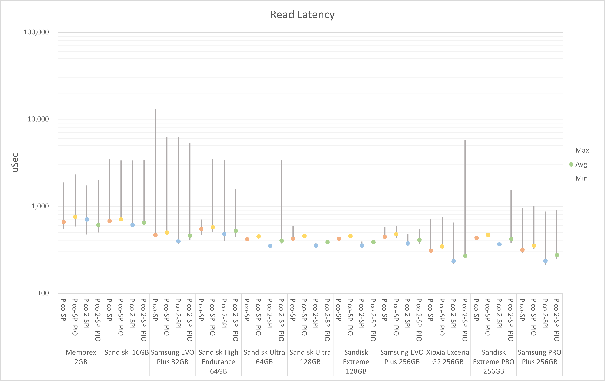

# FatFs library for Raspberry Pi Pico / Pico 2


[](https://github.com/elehobica/pico_fatfs/actions/workflows/build-binaries.yml)

## Overview
FatFs library on Raspberry Pi Pico / Pico 2.
This library supports:
* FatFs R0.15 ([http://elm-chan.org/fsw/ff/00index_e.html](http://elm-chan.org/fsw/ff/00index_e.html))
* Applicable for two types of SPI master functions
  * SPI function applied for compliant pin assignment with native SPI interface of Raspberry Pi Pico series
  * Otherwise, SPI PIO function applied for more flexible pin assignment
* SD, SDHC, SDXC card types
* FAT16, FAT32, exFAT format types
* Test projects for write / read speed benchmark

## Supported Board
* Raspberry Pi Pico / Pico W
* Raspberry Pi Pico 2 / Pico 2W

## Ciruit Diagram


## Pin Assignment
### microSD card

| Pico Pin # | Pin Name | Function | microSD connector | microSD SPI board |
----|----|----|----|----
|  4 | GP2 | SPI0_SCK | CLK (5) | CLK |
|  5 | GP3 | SPI0_TX | CMD (3) | MOSI |
|  6 | GP4 | SPI0_RX | DAT0 (7) | MISO |
|  7 | GP5 | GPIO (Out) | CD/DAT3 (2) | CS |
|  8 | GND | GND | VSS (6) | GND |
| 36 | 3V3(OUT) | 3.3V | VDD (4) | 3V3 |

#### Note
* Pin configuration by user is available. See Configuration section.
* Wire length between Pico and SD card is very sensitive. Short wiring as possible is desired, otherwise errors such as Mount error, Preallocation error and Write fail will occur.

### Serial (CP2102 module)
| Pico Pin # | Pin Name | Function | CP2102 module |
----|----|----|----
|  1 | GP0 | UART0_TX | RXD |
|  2 | GP1 | UART0_RX | TXD |
|  3 | GND | GND | GND |

## Configuration
Configure function, clock and pin assignment by `pico_fatfs_set_config()` with `pico_fatfs_spi_config_t`

```
  pico_fatfs_spi_config_t config = {
      spi0,                   // spi_inst (spi0, spi1 or NULL)
      CLK_SLOW_DEFAULT,       // clk_slow
      CLK_FAST_DEFAULT,       // clk_fast
      PIN_SPI0_MISO_DEFAULT,  // pin_miso (SPIx_RX)
      PIN_SPI0_CS_DEFAULT,    // pin_cs
      PIN_SPI0_SCK_DEFAULT,   // pin_sck  (SPIx_SCK)
      PIN_SPI0_MOSI_DEFAULT,  // pin_mosi (SPIx_TX)
      true                    // pullup
  };
  bool spi_configured = pico_fatfs_set_config(&config);
```

### SPI function or SPI PIO function
* Choose `spi0`, `spi1` for SPI function or `NULL` explicitly for SPI PIO function
* Note that SPI PIO function could be implicitly configured for the case of incompliant pin assignment for SPI function.
* The return value of `pico_fatfs_set_config()` indicates finally configured function (true: SPI, false SPI PIO).

### SCK frequency configuration
* By default, `clk_slow` as `100 * KHZ` and `clk_fast` as `50 * MHZ` are used for the configuration.
* For SPI function, the actual SPI clock frequency is set to clk_peri / 2N, which is determined by spi_set_baudrate() in ['pico-sdk/src/rp2_common/hardware_spi/spi.c'](https://github.com/raspberrypi/pico-sdk/blob/2062372d203b372849d573f252cf7c6dc2800c0a/src/rp2_common/hardware_spi/spi.c#L41).
  * For rp2040, 125 MHz / 4 is applied. SCK frequency is 31.25 MHz.
  * For rp2350, 150 MHz / 4 is applied. SCK frequency is 37.50 MHz.
* For SPI PIO funciton, the maximum SCK frequency is limited up to the system frequency divided by 6.
  * For rp2040, SCK freq <= 125 MHz / 6 is applied. SCK frequency is 20.83 MHz.
  * For rp2350, SCK freq <= 150 MHz / 6 is applied. SCK frequency is 25.00 MHz.
* The actual operating SCK frequency is available by `pico_fatfs_get_clk_fast_freq()` after `f_mount()`.

### Pin assignment
* For SPI function configuration, the pin assignment needs to satisfy the below constraints, otherwise SPI PIO function will be configured implicitly even though `spi0` or `spi1` is designated.

| SPI role | Pico pin category | GPx for SPI0 | GPx for SPI1 |
----|----|----|----
|  MISO | SPIx_RX | 0, 4, 16, 20, (32, 36) | 8, 12, 24, 28, (40, 44)|
|  SCK | SPIx_SCK | 2, 6, 18, 22, (34, 38) | 10, 14, 26, (30, 42, 46) |
|  MOSI | SPIx_TX | 3, 7, 19, 23, (35, 39) | 11, 15, 27, (31, 43, 47) |

(): rp2350 only

### Pullup
* Set `true` to use internal pullup for MISO and MOSI (recommended), otherwise, set `false` when external pullup resistors attached for MISO and MOSI as shown in [external pullup](doc/Pico_FatFs_Test_Schematic_w_pullup.png)

### SPI PIO configuration
* Configure PIO and state machine by `pico_fatfs_config_spi_pio()` for the case of SPI PIO function.
* Default is PIO0 (`SPI_PIO_DEFAULT_PIO`) and state machine 0 (`SPI_PIO_DEFAULT_SM`).
* Only effective when SPI PIO function configured. No impact when SPI function is configured.

```
  bool spi_configured = pico_fatfs_set_config(&config);
  if (!spi_configured) {
      pico_fatfs_config_spi_pio(pio0, 0);  // PIO, sm
  }
```

## FatFs Function customization
User can also override following functions as they are defined with _weak_ attribute.
* `DWORD get_fattime()` in [tf_card.c](tf_card.c)

## How to build
* See ["Getting started with Raspberry Pi Pico"](https://datasheets.raspberrypi.org/pico/getting-started-with-pico.pdf)
* Put "pico-sdk", "pico-examples" and "pico-extras" on the same level with this project folder.
* Set environmental variables for PICO_SDK_PATH, PICO_EXTRAS_PATH and PICO_EXAMPLES_PATH
* Confirmed with Pico SDK 2.1.1
```
> git clone -b 2.1.1 https://github.com/raspberrypi/pico-sdk.git
> cd pico-sdk
> git submodule update -i
> cd ..
> git clone -b sdk-2.1.1 https://github.com/raspberrypi/pico-examples.git
>
> git clone -b sdk-2.1.1 https://github.com/raspberrypi/pico-extras.git
> 
> git clone -b main https://github.com/elehobica/pico_fatfs.git
```
### Windows
* Build is confirmed with Developer Command Prompt for VS 2022 and Visual Studio Code on Windows environment
* Confirmed with cmake-3.27.2-windows-x86_64 and gcc-arm-none-eabi-10.3-2021.10-win32
* Lanuch "Developer Command Prompt for VS 2022"
```
> cd pico_fatfs\tests\xxxx
> mkdir build && cd build
> cmake -G "NMake Makefiles" ..  ; (for Raspberry Pi Pico 1 series)
> cmake -G "NMake Makefiles" -DPICO_PLATFORM=rp2350 ..  ; (for Raspberry Pi Pico 2)
> nmake
```
* Put "*.uf2" on RPI-RP2 or RP2350 drive
### Linux
* Build is confirmed with [pico-sdk-dev-docker:sdk-2.1.1-1.0.0]( https://hub.docker.com/r/elehobica/pico-sdk-dev-docker)
* Confirmed with cmake-3.22.1 and arm-none-eabi-gcc (15:10.3-2021.07-4) 10.3.1
```
$ cd pico_fatfs/tests/xxxx
$ mkdir build && cd build
$ cmake ..  # (for Raspberry Pi Pico 1 series)
$ cmake -DPICO_PLATFORM=rp2350 ..  # (for Raspberry Pi Pico 2)
$ make -j4
```
* Download "*.uf2" on RPI-RP2 or RP2350 drive

## Benchmark
### Condition
* Board: Raspberry Pi Pico / Pico 2
* Inrerface function: SPI / SPI PIO
* SPI clock frequency: clk_fast = 50 MHz (See logs for actual operating frequency)

### SD cards (microsd)
* Click the number for the logs in detail

| # | Image | Vendor | Name | Capacity | P/N | Standard | Format |
----|----|----|----|----|----|---|-----
| <a href="doc/benchmark/01 - Memorex 2GB/" target="_blank">1</a> |  | Memorex | - | 2GB | - | microSD | FAT16 |
| <a href="doc/benchmark/02 - Sandisk 16GB/">2</a> |  | SanDisk | - | 16GB | - | microSDHC C4 | FAT32 |
| <a href="doc/benchmark/03 - Samsung EVO Plus 32GB/">3</a> |  | Sansung | EVO Plus | 32GB | MB-MC32GA | microSDHC UHS-I U1 | FAT32 |
| <a href="doc/benchmark/04 - Sandisk High Endurance 64GB/">4</a> |  | Sandisk | High Endurance | 64GB | SDSQQNR-064G | microSDXC UHS-I C10 U3 V30 | exFAT |
| <a href="doc/benchmark/05 - Sandisk Ultra 64GB/">5</a> |  | Sandisk | Ultra | 64GB | SDSQUAC-64G-GN6MN | microSDXC UHS-I A1 C10 U1 | exFAT |
| <a href="doc/benchmark/06 - Sandisk Ultra 128GB/">6</a> |  | Sandisk | Ultra | 128GB | SDSQUNR-128G | microSDXC UHS-I C10 | exFAT |
| <a href="doc/benchmark/07 - Sandisk Extreme 128GB/">7</a> |  | Sandisk | Extreme | 128GB | SDSQXAA-128G-GN6MN | microSDXC UHS-I A2 U3 V30 | exFAT |
| <a href="doc/benchmark/08 - Samsung EVO Plus 256GB/">8</a> |  | Samsung | EVO Plus | 256GB | MB-MC256KA | microSDXC UHS-I A2 U3 V30 | exFAT |
| <a href="doc/benchmark/09 - Kioxia Exceria G2 256GB/">9</a> |  | Xioxia  | Exceria G2 | 256GB | LMEX2L256GG2 | microSDXC UHS-I U3 V30 | exFAT |
| <a href="doc/benchmark/10 - Sandisk Extreme PRO 256GB/">10</a> |  | Sandisk | Extreme PRO | 256GB | SDSQXCD-256G-GN6MA | microSDXC UHS-I A2 U3 V30 | exFAT |
| <a href="doc/benchmark/11 - Samsung PRO Plus 256GB/">11</a> |  | Samsung | PRO Plus | 256GB | MB-MD256SA | microSDXC UHS-I A2 U3 V30 | exFAT |

* For Samsung PRO Plus, benchmark tests are measured every time after power cycle, otherwise the write performance becomes illegally high due to internal cache? in case of same contents writing.

### Write performance
* The speed in KB/s (1 KB = 1000 bytes) for the case of writing total 5MB file divided by 512 byte accesses.

 

### Write latency
* The maximum / minimum / average latency in microseconds to get the response from single `f_write()` for 512 bytes.
* The latency of the first time call of `f_write()` is excluded to ignore the time required for the initialization.

 

### Read performance
* The speed in KB/s (1 KB = 1000 bytes) for the case of reading total 5MB file divided by 512 byte accesses.

 

### Read latency
* The maximum / minimum / average latency in microseconds to get the response from single `f_read()` for 512 bytes.
* The latency of the first time call of `f_read()` is excluded to ignore the time required for the initialization.

 